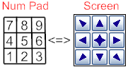

# Winsplit-Revolution

## Table of Contents

- [Winsplit-Revolution](#winsplit-revolution)
  - [Table of Contents](#table-of-contents)
  - [Basic Functions](#basic-functions)
    - [Virtual Numpad (Pop-up)](#virtual-numpad-pop-up)
  - [Special Functions](#special-functions)
    - [Mosaic Function](#mosaic-function)
    - [Close All Function](#close-all-function)
    - [Fusion Function](#fusion-function)
    - [Auto Placement Function](#auto-placement-function)
    - [Move Window To Screen](#move-window-to-screen)
    - [Drag'n'go](#dragngo)
    - [Active Window Tools](#active-window-tools)
    - [Toggle "Always On Top"](#toggle-always-on-top)
    - [Maximize Horizontally Or Vertically](#maximize-horizontally-or-vertically)
  - [Basic Settings](#basic-settings)
    - [About Winsplit Revolution](#about-winsplit-revolution)
    - [Help](#help)
    - [Hotkey Settings](#hotkey-settings)
    - [Layout Settings](#layout-settings)
    - [Options](#options)
    - [Launch With Windows](#launch-with-windows)
  - [Advanced Settings](#advanced-settings)
    - [General Tab](#general-tab)
    - [Virtual Numpad Tab](#virtual-numpad-tab)
    - [Web Update Tab](#web-update-tab)
    - [Drag'N'Go Tab](#dragngo-tab)
    - [Misc Tab](#misc-tab)

## Basic Functions

The basic purpose of WinSplit Revolution is to provide the ability to move a window to a specific
position on your screen.

Think of the screen as a grid : when using WinSplit, the process of placing windows on a "cell" of
this grid is simple and intuitive. Using the numeric keypad you can think of the layout of the
keypad as a sort of map of where the window positions will be on the screen.

By hitting a combination of `CTRL + ALT` and the appropriate number on the keypad, you can quickly
send windows to specific quadrants of the screen.

To move the active window (the one which is focused) to a specific location on the screen, use the
following shortcuts: Ctrl+Alt+Numeric Pad

- `Ctrl+Alt+1` = Bottom left corner of the screen
- `Ctrl+Alt+2` = Bottom part
- `Ctrl+Alt+3` = Bottom right corner
- `Ctrl+Alt+4` = Left part
- `Ctrl+Alt+5` = Full screen
- `Ctrl+Alt+6` = Right part
- `Ctrl+Alt+7` = Upper left corner
- `Ctrl+Alt+8` = Upper part
- `Ctrl+Alt+9` = Upper right corner

There are two modes for window placement. The first time you move a window (for example Ctrl+Alt+7)
the window moves to the upper left corner, taking a quarter of the screen (1/2 of the screen for the
width and height). This makes it possible to show 4 windows at the same time (one window at each
quarter). If you press the key combination again for a window which is still at the same placement,
the window takes 1/6 of the screen (1/2 screen's height and 1/3 screen's width) thus it is possible
to show up to 6 windows at the same time.

**Exceptions**: When you press a shortcut to move a window, WinSplit Revolution moves the
foreground, i.e. the window that has focus. But if this one is a topmost window (always on top)
WinSplit doesn't move it, it will move the last focused non-topmost window.

### Virtual Numpad (Pop-up)

The pop-up is a little control that allows you to avoid having to use your keybord to move a window.
It is useful for people who dislike shortcuts or owners of laptops that do not have numeric pad
keys. To active this control just left click on WinSplit Revolution's icon on the system tray. The
first time you left click on it, a control like the following figure appears.

")

To move the foreground window to a specific position, just click on one of the 9 buttons relevant to
the desired placement location. The two modes regarding placement still apply (1/2 and 1/2 or 1/2
and 1/3) with the virtual numpad pop-up control.

There is a checkbox under the 9 buttons, which (if checked) allows the control to be locked and
always on top otherwise the pop-up control will disappear after the placement. It's possible to keep
the pop-up at a position while excluding the frame around the control by left clicking again on he
WinSplit Revolution's system tray icon. This causes the pop-up control to look like this:

")

## Special Functions

This section explains some of the special functions implemented in WinSplit.

### Mosaic Function

`Ctrl + Alt + M` This function evaluate the best arrangement to show several windows at the same
time.

### Close All Function

`Ctrl + Alt + C` This function instantaneously close all windows opened on the taskbar, by sending a
WM_CLOSE message to the windows.

### Fusion Function

`Ctrl + Alt + F` The purpose of this function is to tile the two last selected windows in addition
to customizing the location of the split. By default each windows takes up half of the screen (one
at the left, the other at the right), and the windows appear with a slider to change the ratio
between the both windows. So it's possible to have 30% - 70% or a 40% - 60% ratio for window
placement.

### Auto Placement Function

`Ctrl + Alt + NumericPad 0` This function allow the user to memorize the position of a window. The
first step is to place the window where you want it to be memorized. Then, press `Ctrl + Alt +
NumPad 0` and WinSplit Revolution will detect that this process is not yet saved, and propose you to
save it. After saving the window process, to replace it at the last saved place, press again `Ctrl +
Alt + NumPad 0` then WinSplit Revolution will detect that the window process is saved and will place
automatically to the saved place. If you want to memorize another position for this window, you
first have to go in the options dialog box, select the corresponding entry in the `Delete saved
Auto-placements` zone of the `General` tab, and press the `Delete` button.

### Move Window To Screen

`Ctrl + Alt + Left / Right` For owners of multi-monitors screen, it is possible to move a window
from a screen to another. For now you can move a window on horizontal direction (Left/Right).

### Drag'n'go

`Ctrl + Alt + Moving a window with the mouse` While moving a window (move naturally with the mouse)
if you press `Ctrl + Alt` at the same time, WinSplit Revolution will propose an automatic placement
respected to the user layout, as shown on the picture:

In the picture above, I move the explorer window to the bottom-left corner, then WinSplit Revolution
detect that correspond to a layout position, and propose with a translucent window this possibility,
when I release the mouse (pressing Ctrl+Alt) the window will be aspired at this place.

### Active Window Tools

`Ctrl + Alt + T` Pressing these keys will show a dialog box that will allow you :

- to take a screenshot of the active window, and putting this screenshot in the clipboard, or saving
  it as an image file.
- change the transparency of the active window.
- add (or remove) the "always on top" style to the active window.

### Toggle "Always On Top"

`Ctrl + Alt + O` This will allow you to directly set or remove the "Always on top" style for the
active window.

### Maximize Horizontally Or Vertically

`Ctrl + Alt + H or V` Pressing these keys will maximize the active window horizontally `Ctrl + Alt +
H` or vertically `Ctrl + Alt + V`.

## Basic Settings

To set the basic WinSplit's behavior, right click on the system tray icon. The following menu
appears:

Here is a description of the different entries you'll find in this menu :

### About Winsplit Revolution

This entry will pop-up a dialog box that shows information on the application (the classical About
box present in most of the applications).

### Help

As there is yet no help file available, this entry will open the help page (the one you are actually
reading) in your browser.

### Hotkey Settings

The Hotkey settings section allows you to change the shortcut associated with a task. It's possible
to change and/or to deactivate a task.

### Layout Settings

Allows you to change the default layout.

### Options

This entry will show an options dialog box, witch will allow you to configure the application, the
virtual numpad behavior, the auto-placement positions, ...

### Launch With Windows

This option causes WinSplit Revolution to be automatically launched at the system's startup.

## Advanced Settings

Here is the description of all the settings you'll find in the options dialog box shown from the
entry of the system-tray icon.

### General Tab

This section allows you to define the general settings of the application :

- **The language** : you can select your preferred language between the ones available in the
  listbox.

- **Taking "Topmost windows" into account** : by default, windows with this style are not moved by
  the hotkeys. You can modify this behavior by checking this options.

- **Saved auto-placements** : You can use this section to remove registered windows auto-placement
  (Ctrl + Alt + Numpad 0).

- **Screenshots temp files** : The "Active window tools" screenshot functionality has to store the
  resulting image files when they are dragged. Use one of the available options to tell Winplit what
  to do with these files.

- **Settings management** : You can use these two button to backup or restore all your settings.

### Virtual Numpad Tab

This section allows you to define the Virtual Numpad behavior. Just have a look at the screenshot
below to see witch are the options available on this tab.

### Web Update Tab

This section allows you to define the application behavior concerning the automatic web update. Just
have a look at the screenshot below to see witch are the options and commands available.

### Drag'N'Go Tab

This section concerns the Drag'N'Go functionality. Just have a look at the screenshot below to see
the available options.

### Misc Tab

The first section on this tab concerns the Microsoft Windows built-in functionality called "*Active
Window Tracking*". When this functionality is enabled, and the mouse is moved over an open window, it
automatically sets the focus to that particular window. There is an additional option to this
functionality to automatically bring the window to the foreground of the open windows. And you can
also set the delay before the activation of all of this.

The options in the second section allows Winsplit to move the mouse pointer while it moves a window,
and defines the "Minimize / Maximize" hotkeys behavior.

